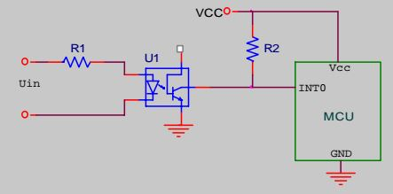
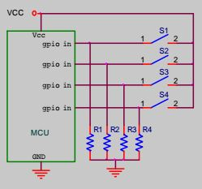
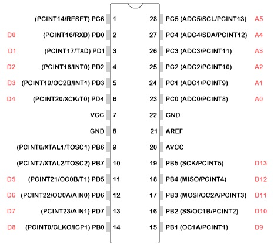

# Control cooker hood with ATmega328P

Replace the original control board of an cooker hood with ATmega328P and extend its functionality. Connect the board to OpenHab via MQTT [send/receive commands] by using serial pins and external Arduino with ethernet module.


### Prerequisits
* 220/230 V 
* One coil only motors
* Control butons: Lights (count pushes), OnOff, Minus, Plus, Max

### Notes
* Schematic is based on http://playground.arduino.cc/Main/ACPhaseControl 

  Zero cross detection
  
  
  
  Buttons
  
  

* Code

1. Thyristor gate offset values are defined in uC cycles.
 - Counter max value = 65535. The counter reaches its MAXimum when it becomes 0xFFFF (decimal 65535)
 - uC ATmega328P works on 16MHz 
 - 1 uC cycle will be executed for 1 / 16000 = 0,0625us = 0,0000000625s
 - 1 uC cycle will take 0,0000000625 * 65535 = 0,0040959375s which is ~ 4ms
 - Timer1 scale should be 256
  ```
  GATE_OFFSET_MAX = 160000 / 256 = 625 cpu cycles
  ```
2. Debounce time is defined in us.
3. MQTT not implemented in this code yet.

:warning: Testing in progress. For more details see the comments.

### ATmega328P Pinout


